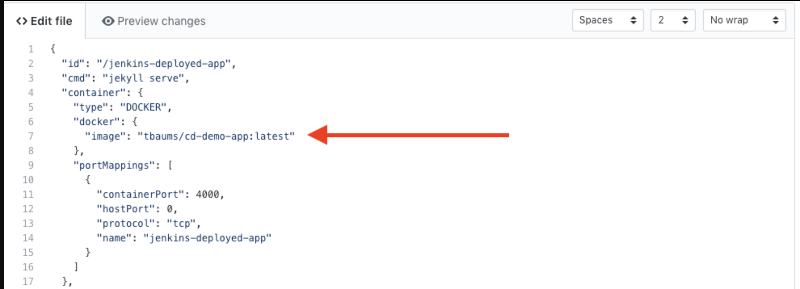

# Lab 2 - Configure GitHub Repository 

In this lab exercise, you will modify your forked `cd-demo` repository to point to your DockerHub account and your DC/OS cluster.

## Step 1 - Navigate to `/conf/cd-demo-app.json`

From your forked `cd-demo` repository homepage, navigate to the `conf` directory.

Within the `conf` directory, select `cd-demo-app.json`. This file contains all the necessary specifications for Marathon to deploy your app and expose it publicly via Marathon-LB (installed in Lab 1).

Next, select the pencil icon to make changes to the `cd-demo-app.json` file directly in your browser.

You need to adjust one value in this JSON specification. 

Modify the Docker image to `<your Docker hub username>/cicd-demo:latest`. This is where Marathon will look to pull the app's container image after Jenkins has pushed it to Dockerhub. Please note that while DockerHub allows you to log in with your email address, *you must use your DockerHub **username** here*.

[Next Lab >>](https://github.com/tbaums/dcos-mandt-labs/blob/master/labs/4%20-%20CICD-labs/Lab_03_Configure_Jenkins.md)